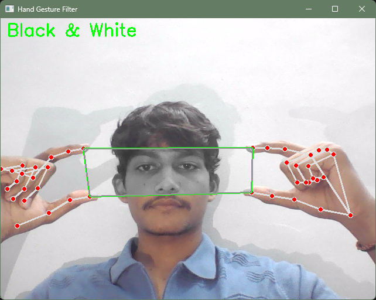
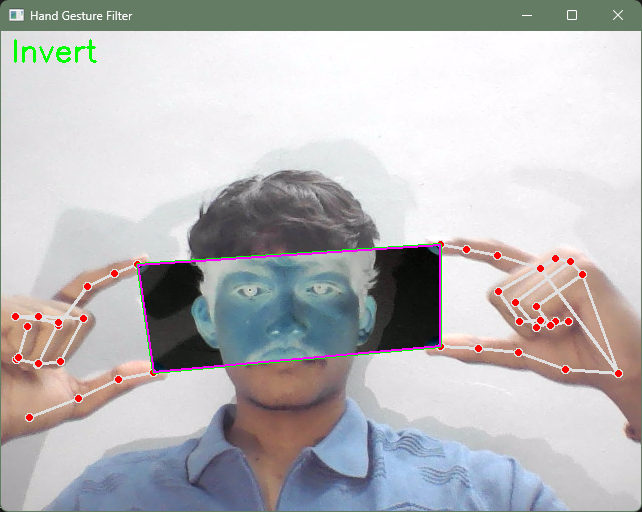
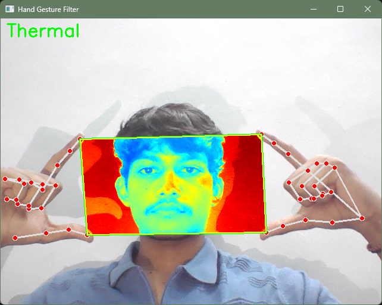
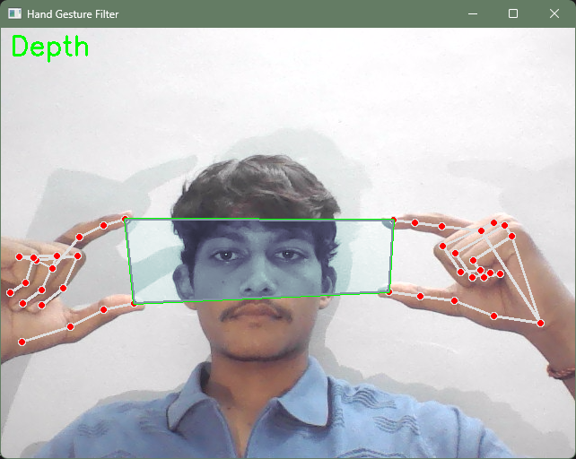

# Hand Gesture Filter

This Python application uses your webcam and hand gestures to apply real-time image filters to a selected region of the video feed.

## Features
- Detects both hands and tracks thumb and index fingertips.
- Applies filters (Black & White, Invert, Thermal, Depth) to the area between both index fingertips and both thumb tips.
- Change filters by pinching (bringing thumb and index together) on either hand.
- Enlarged display window for better visibility.

## How to Run
1. Install dependencies:
   ```bash
   pip install -r requirements.txt
   ```
2. Run the application:
   ```bash
   python hand_gesture_filter.py
   ```
3. Use both hands, extend thumbs and index fingers, and pinch to cycle filters.
4. Press 'q' to exit.

## Example Filter Results
Upload sample images for each filter below:

### Black & White


### Invert


### Thermal


### Depth


Create an `images` folder and upload your filter result screenshots there.
